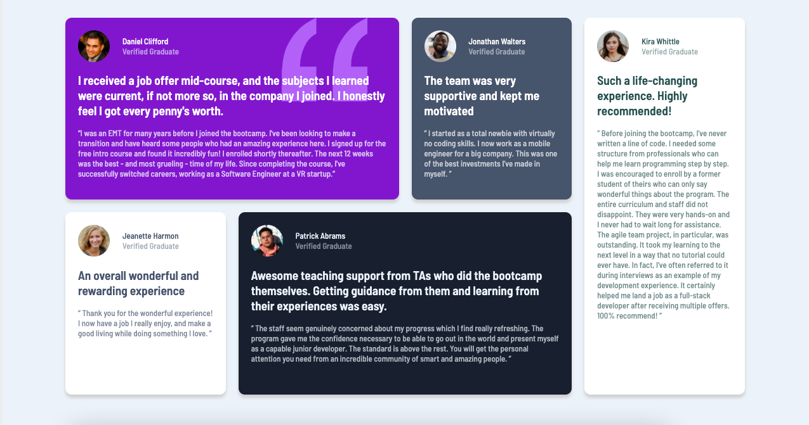

# Frontend Mentor - Testimonials grid section solution

This is a solution to the [Testimonials grid section challenge on Frontend Mentor](https://www.frontendmentor.io/challenges/testimonials-grid-section-Nnw6J7Un7). Frontend Mentor challenges help you improve your coding skills by building realistic projects. 

## Table of contents

- [Overview](#overview)
  - [The challenge](#the-challenge)
  - [Screenshot](#screenshot)
  - [Links](#links)
- [My process](#my-process)
  - [Built with](#built-with)
  - [What I learned](#what-i-learned)
  - [Continued development](#continued-development)
  - [Useful resources](#useful-resources)
- [Author](#author)

**Note: Delete this note and update the table of contents based on what sections you keep.**

## Overview

### The challenge

Users should be able to:

- View the optimal layout for the site depending on their device's screen size

### Screenshot

### Links

- Solution URL: [Add solution URL here](https://your-solution-url.com)
- Live Site URL: [Add live site URL here](https://your-live-site-url.com)

## My process

### Built with

- Semantic HTML5 markup
- CSS custom properties
- Flexbox
- CSS Grid
- Mobile-first workflow

### What I learned

I wanted to practice CSS grid and Flexbox to reproduce a clean, dynamic layout. I tried to give a class to as many elements as possible in order for CSS to be understood clearly, and to be able to target styles to specific elements.

### Continued development

I want to practice more with device-width cutoffs and grid responsiveness. I attempted to use the auto-fit and auto-fill properties, along with minmax, but I didn't quite have a grasp on this. I want to get some more practice with these in order to make dynamic grids that look great on different screen sizes.

### Useful resources

## Author

- Frontend Mentor - [@Michaella](https://www.frontendmentor.io/profile/michaella23)
- Twitter - [@NotMichaella](https://twitter.com/NotMichaella)
